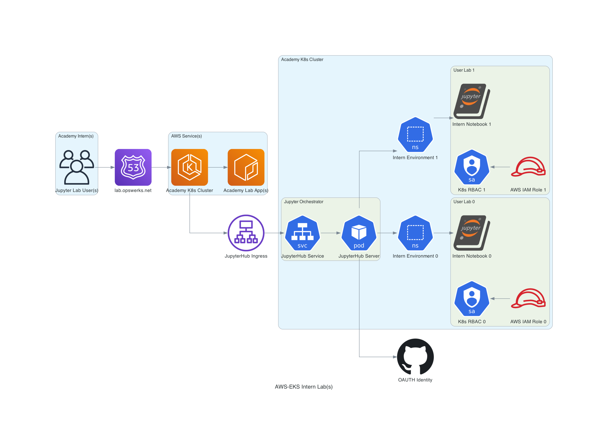

# ephemeral-labs-aws-eks-2023

### Architecture:



### Usage:

**Disclaimer**
```
The code in here does not include the secrets used for the whole setup so tweaks are required to reuse this module
The code also expects an already existing K8s cluster as the IAC does not include the AWS EKS deployment
```
#### Instruction(s):
1. Prerequisite(s)
   1. [Pulumi](https://www.pulumi.com/docs/install/)
   2. [Python](https://www.python.org/downloads/)
      1. See "runtime.txt" to get the specific version used
   3. [AWS CLI](https://docs.aws.amazon.com/cli/latest/userguide/getting-started-install.html)
   4. [Kubectl](https://kubernetes.io/docs/tasks/tools/install-kubectl-macos/#install-with-homebrew-on-macos)
   5. [Helm](https://helm.sh/docs/intro/install/#from-homebrew-macos)
      1. Had to run helm via CLI (pulumi_command.local.Command) due to a bug encountered via Pulumi
   6. Authentication/Authorizations: [Github OAUTH](https://docs.github.com/en/apps/oauth-apps/building-oauth-apps/authorizing-oauth-apps)
      1. Other tool(s) can be used as well (Google OAUTH, Gitlab OAUT, Okta, etc...)  
2. Setup
   1. Clone this repository
   ```
   git clone git@github.com:opswerks/ephemeral-labs-aws-eks-2023.git
   cd ephemeral-labs-aws-eks-2023/tools/jupyterhub/proj-py/
   ```
   2. Initialize the infrastructure
   ```
   pulumi stack init aws2023-jupyterhub
   ```
   3. Run the deployment to create the declared resources
   ```
   pulumi up
   ```
   4. Destroy the deployed resources
   ```
   pulumi destroy
   ```
3. Reference(s)
   * https://www.pulumi.com/registry/packages/aws/api-docs/
   * https://www.pulumi.com/registry/packages/kubernetes/api-docs/
   * https://www.pulumi.com/registry/packages/docker/api-docs/
   * https://www.pulumi.com/registry/packages/command/api-docs/local/command/
